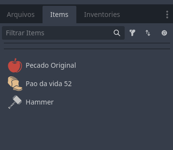

# P0nni Inventory System

**Autor:** p0nni / AdrianJpSantos
**Versão:** 1.0

## 🌟 Visão Geral

Este é um sistema de inventário **Data-Driven** (orientado a dados) para Godot Engine, projetado para ser modular e focado na lógica de gerenciamento de itens, separando os dados da interface visual (UI). Ele fornece uma base robusta para funcionalidades complexas, livre de bugs comuns como duplicação de itens.

**Princípios Fundamentais:**
*   **Lógica vs. Visualização:** O núcleo do sistema (`Item`, `ItemStack`, `Inventory`) é totalmente independente da sua UI. Você pode construir qualquer interface visual sobre essa base sólida.
*   **Orientado a Dados:** Itens e inventários são `Resources` do Godot (`.tres`), permitindo que você os crie e edite diretamente no editor.

**Funcionalidades Principais:**
*   **Empilhamento Inteligente:** Respeita o limite `max_per_stack` de cada item.
*   **Troca Atômica (Swapping):** Troca itens entre slots de forma segura.
*   **Transferência entre Inventários:** Move itens facilmente entre o jogador, baús, lojas, etc.

---

## ⚙️ Configuração Rápida

Para começar a usar o sistema, siga estes dois passos:

### 1. Definir o `InventoriesController` como AutoLoad

O `InventoriesController` é o coração do sistema, funcionando como um **Singleton (AutoLoad)** que fornece acesso global a todas as funções.

1.  Vá em **Projeto > Configurações do Projeto > AutoLoad**.
2.  No campo "Caminho", selecione o script `res://addons/p0nni_inventory_system/scripts/inventory_system/inventories_controller.gd`.
3.  Defina o "Nome do Nó" como **`Inventories`** (com 'I' maiúsculo).
4.  Clique em "Adicionar".

**Importante:** Na lista de AutoLoads, o `InventoriesController` deve ser carregado **antes** de qualquer script que o utilize (como o script do jogador). Você pode arrastá-lo para cima na lista para garantir a ordem correta de inicialização.

Isso permitirá que você chame funções do sistema de qualquer lugar do seu código, como `Inventories.get_primary()`.

### 2. Inicializar o Inventário Principal

No script de inicialização do seu jogo (como o do jogador), você precisa carregar o recurso de inventário e registrá-lo no controller.

```gdscript
# Exemplo em Player.gd ou GameManager.gd
extends Node

# Arraste seu recurso de inventário (.tres) para esta variável no Inspector
@export var player_inventory_resource: Inventory 

func _ready():
    # Registra o inventário principal do jogador no núcleo do sistema
    Inventories.set_primary_inventory(player_inventory_resource)
    
    # Exemplo: Como adicionar um item ao jogador via código
    var apple_item = preload("res://examples_resources/items/apple.tres")
    var leftover = Inventories.get_primary().push_item_on_stacks(apple_item, 5)
    
    if leftover > 0:
        print("O inventário está cheio. Sobraram %d maçãs." % leftover)

```

---

## 🎨 Sobre as Camadas (`scripts/inventory_system/layers.gd`)

O arquivo `layers.gd` serve para categorizar `Items` e `Inventories` usando enums. Isso é útil para organizar e criar lógicas específicas, como:
*   Um slot que só aceita itens do tipo `WEAPON`.
*   Um baú que pertence à camada `CONTAINER_STORAGE`.

### **Importante: Modifique sem medo!**

Este arquivo foi criado como um exemplo abrangente. **Você tem total liberdade para modificá-lo**.

*   **Delete o que não precisa:** Seu jogo pode não ter `PET_OR_SUMMON` ou `SCROLL`. Sinta-se à vontade para apagar as categorias que não se aplicam ao seu projeto.
*   **Adicione suas próprias categorias:** Crie novas camadas que façam sentido para o seu game.
*   **Mantenha o `MISC`:** É uma boa prática manter a camada `Item.MISC`, pois ela serve como uma categoria padrão para itens variados ou sem uso específico.
*   **Mantenha o `SYSTEM_MISC`:** É uma boa prática manter a camada `Inventory.SYSTEM_MISC`, pois ela serve como uma categoria padrão para inventarios variados ou sem uso específico.


---

## 💡 Liberdade para Melhorar

Este plugin é uma base. Sinta-se livre para estender, modificar e adaptar o código para atender às necessidades do seu projeto. Se você criar uma melhoria ou corrigir um bug, considere compartilhar com a comunidade!

Obrigado por usar o P0nni Inventory System!


-----

## ⚙️ Configuração (Setup Inicial)

Para usar o sistema, apenas duas etapas são necessárias:

### 1\. Definir o `InventoriesController` como AutoLoad

O `InventoriesController` é o **Singleton (AutoLoad)** do sistema, fornecendo acesso global à API.

  * Vá em **Projeto** \> **Configurações do Projeto** \> **AutoLoad**.
  * Adicione o script `inventories_controller.gd`.
  * Defina o nome de nó global como **`Inventories`**.

**Importante:** Na lista de AutoLoads, o `InventoriesController` deve ser carregado **antes** de qualquer script que o utilize (como o script do jogador). Você pode arrastá-lo para cima na lista para garantir a ordem correta de inicialização.

Isto permite que você chame todas as funções do Core com `Inventories.<função>`.

### 2\. Inicializar o Inventário Principal

No script inicial do seu jogador ou gerenciador de jogo, você deve carregar seu recurso de inventário e registrá-lo no Controller.

```gdscript
# Exemplo de inicialização (Player.gd ou GameManager.gd)
extends Node

@export var player_inventory_resource: Inventory # Carregue seu .tres aqui

func _ready():
	# Registra o inventário principal do jogador no Core
	Inventories.set_primary_inventory(player_inventory_resource)
	
	# Exemplo: Como dar um item ao jogador (sem UI)
	var potion = preload("res://Items/HealthPotion.tres")
	var leftover = Inventories.get_primary().push_item_on_stacks(potion, 5)
	
	if leftover > 0:
		print("Ainda sobraram %d poções, o inventário estava cheio." % leftover)
```

-----

## 🧱 Estrutura de Dados (Core Resources)

O sistema é construído sobre três `Resources` principais. Entender como eles funcionam é fundamental para usar o plugin de forma eficaz.

### 1. Item (`Item.gd`)
É a definição de um item. Pense nele como um "template" ou "blueprint". Ele não armazena dados de um item específico em um inventário, mas sim as propriedades que todos os itens daquele tipo compartilham.
*   **Exemplo:** `Apple.tres` define que todas as maçãs têm `max_per_stack = 20` e um ícone específico.

### 2. ItemStack (`item_stack.gd`)
Representa um "slot" no inventário. Ele contém a referência a um `Item` e a `quantity` (quantidade) daquele item no slot. É aqui que os dados de instância são realmente armazenados.

### 3. Inventory (`inventory.gd`)
É um `Resource` que contém uma lista de `ItemStack`s, além de um `id` e `title` para identificação. A grande vantagem desta abordagem é a flexibilidade:

*   **Inventários Pré-definidos:** Como `Inventory` é um recurso, você pode criar inventários no editor (como `chest_1.tres`) e pré-definir os itens que estarão dentro dele. Isso é perfeito para criar baús com loot fixo, lojas de NPCs com um estoque inicial específico ou o inventário inicial do jogador.

*   **Facilidade para Aleatoriedade:** Se você precisar de um baú com loot aleatório, pode facilmente criar um novo script que herda de `Inventory` (ex: `RandomLootInventory.gd`). Nesse script, você pode usar a função `_init()` ou uma função customizada para preencher os `stacks` com itens aleatórios no momento em que o baú for gerado no jogo.

```gdscript
# Exemplo de um inventário com loot aleatório (RandomLootInventory.gd)
class_name RandomLootInventory
extends Inventory

# Lista de possíveis itens para dropar
@export var loot_table: Array[Item]

func _init():
    # Lógica para preencher o inventário com itens aleatórios da loot_table
    randomize_loot()

func randomize_loot():
    # ... seu código para adicionar itens aleatórios aos stacks ...
    pass
```

-----

## 💾 Core da API: Classes de Dados (Resources)

As classes de dados são `Resource`s e são o coração do sistema. Elas devem ser manipuladas primariamente através dos métodos do `InventoriesController`.

### 1\. Item (`Item.gd`)

Recurso base para todos os itens do jogo. É a fonte de informação para a UI.

| Propriedade/Método | Tipo | Descrição |
| :--- | :--- | :--- |
| `@export var name` | `String` | Nome do item (para tooltips e UI). |
| `@export var max_per_stack`| `int` | **Limite de empilhamento** (ex: 1 para Espada, 99 para Poção). |
| `is_equal(other_item)` | `bool` | Checa se dois itens são iguais (usando `resource_path`). |

### 2\. ItemStack (`item_stack.gd`)

Representa um **slot individual** no inventário.

| Tipo | Nome | Descrição |
| :--- | :--- | :--- |
| **Propriedade** | `@export var item` | Referência ao Resource do `Item` que a pilha contém. |
| **Propriedade** | `@export var quantity`| A quantidade atual do item na pilha. |
| **Método** | `push_item(Item, qty) -> int` | **Empilhamento.** Adiciona o item à pilha. Retorna a quantidade que **sobra**. |
| **Método** | `swap_item(Item, qty)` | **Substituição atômica.** Sobrescreve `item` e `quantity`. Usado pelo Controller para Troca. |
| **Método** | `use_item()` | Decrementa `quantity` em 1 e limpa o slot se a quantidade chegar a zero. |
| **Método** | `reset(force: bool)` | Zera `quantity`. Se `force=true`, define `item = null` e `quantity = 0`. |
| **Sinal** | `stack_changed(stack: ItemStack)` | **CRÍTICO\!** Emitido sempre que `item` ou `quantity` mudam. **Sua UI de slot deve se conectar a este sinal**. |

### 3\. Inventory (`inventory.gd`)

O contêiner que armazena o array de `ItemStack`s.

| Método/Sinal | Tipo | Descrição |
| :--- | :--- | :--- |
| `@export var id` | `String` | Identificador único para o inventário (ex: "player_inventory", "chest_01"). |
| `@export var title` | `String` | Nome de exibição para a UI (ex: "Mochila", "Baú de Tesouros"). |
| `@export var stacks` | `Array[ItemStack]` | O array de todos os slots de dados (configurados via Resource no Inspector). |
| `push_item_on_stacks(Item, qty)` | `int` | **Entrada de Item.** Tenta adicionar o item em todos os slots disponíveis. Retorna a sobra não adicionada. |

-----

## 🕹️ InventoriesController (AutoLoad: `Inventories`)

O `InventoriesController` é o orquestrador de toda a lógica de inventário. Por ser um AutoLoad (Singleton), ele está sempre acessível globalmente através do nome `Inventories`.

### Métodos Principais

| Método | Descrição |
| :--- | :--- |
| `set_primary_inventory(inv: Inventory)` | **(Chamar apenas uma vez!)** Define o inventário principal do jogo, geralmente o do jogador. Este método deve ser chamado no início do jogo para registrar o inventário que será persistente. |
| `get_primary() -> Inventory` | Retorna o inventário principal que foi definido. |
| `set_secondary_inventory(inv: Inventory)` | Define um inventário secundário temporário. Ideal para interações com baús, lojas ou outros contêineres. A UI deve ouvir o sinal `secondary_inventory_changed` para abrir a janela correspondente. |
|  `get_secondary() -> Inventory` | Retorna o inventário secundario que estiver definido (Bau, Loja, etc).|
| `remove_secondary_inventory()` | Remove a referência ao inventário secundário. A UI deve usar isso para fechar a janela do contêiner. |
| `change_item_on_stack_for_other(stack_out, stack_in)` | **Lógica Central de Interação.** Esta é a função mais importante para a sua UI. Ela gerencia de forma inteligente a movimentação de itens entre dois slots, decidindo se deve empilhar, trocar ou mover. |

### Sinais

| Sinal | Descrição |
| :--- | :--- |
| `primary_inventory_changed(inventory)` | Emitido quando o inventário primário é definido via `set_primary_inventory`. |
| `secondary_inventory_changed(inventory)` | Emitido quando um inventário secundário é definido ou removido. Envia o objeto `Inventory` ao ser definido e `null` ao ser removido. |

-----

## 🎨 Diretrizes para Criação de UI Customizada

O sistema de UI de exemplo (`InventorySlotUI`, `InventoryPanel`) deve ser descartado ou usado apenas como referência. Para construir sua UI customizada, siga este fluxo:

1.  **Crie seu Slot UI** (ex: `MyCustomSlot.tscn`):
	  * Deve ter uma variável que armazene uma referência a um `ItemStack`.
	  * Na função de inicialização, chame `my_item_stack.stack_changed.connect(_update_visuals)`.
2.  **Crie seu Gerador de Painel** (`MyPanel.gd`):
	  * Recebe um objeto `Inventory` (via `get_primary()` ou `get_secondary()`).
	  * Itera sobre o array `inventory.stacks`.
	  * Para cada `ItemStack` no array, instancia um `MyCustomSlot` e chama `my_custom_slot.set_stack(item_stack)`.
3.  **Lógica de Interação (Clique):**
	  * No seu script que gerencia os cliques (o equivalente ao `InventoriesControllerUI`), use:
		```gdscript
		# Quando um slot A (held_stack) é arrastado para um slot B (clicked_stack):
		Inventories.change_item_on_stack_for_other(held_stack.item_stack, clicked_stack.item_stack)

		# Sua responsabilidade: Forçar a atualização visual dos dois slots
		held_stack.update_visuals()
		clicked_stack.update_visuals()
		```

---

## 🗂️ Docks de Itens e Inventários

Para facilitar a criação e edição de `Items` e `Inventories`, o plugin adiciona dois novos Docks ao editor do Godot: "Items" e "Inventories".



Esses painéis oferecem uma maneira visual e centralizada de gerenciar todos os seus recursos de inventário, evitando que você precise procurá-los em várias pastas.

### Como Funciona?

Os docks escaneiam pastas específicas do seu projeto em busca de arquivos de recurso (`.tres`). Para que seus itens e inventários apareçam nos painéis, eles **devem** ser salvos nos seguintes diretórios:

*   **Itens:** `res://resources/inventories/items/`
*   **Inventários:** `res://resources/inventories/inventory/`

Você pode clicar em um item ou inventário na lista para abri-lo diretamente no Inspector e fazer suas modificações.

**Nota:** Os caminhos `const ITEM_RESOURCES_PATH` e `const INVENTORY_RESOURCES_PATH` podem ser modificados nos scripts do dock (`godot_interface/scripts/items_tab.gd` e `godot_interface/scripts/inventory_tab.gd`) se você preferir organizar seus recursos em outro lugar.
